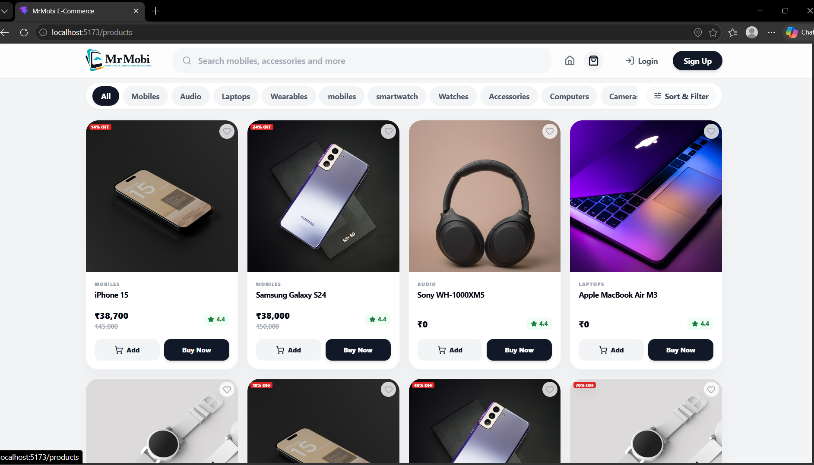
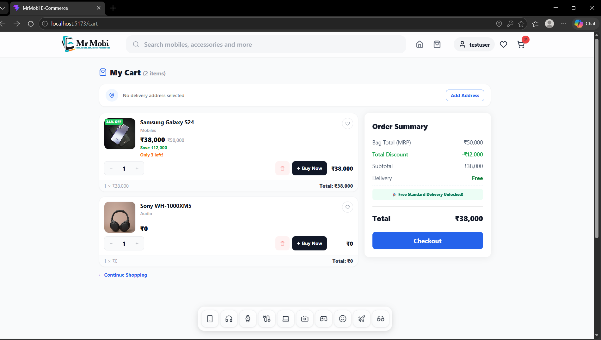
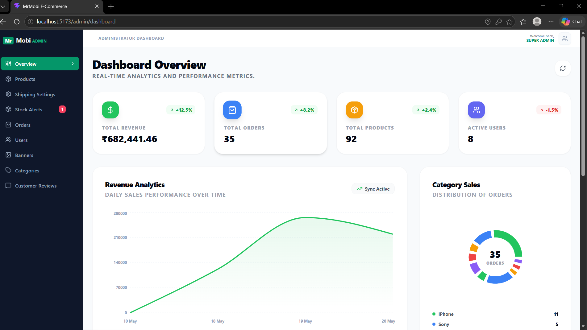

# MrMobi Store — Full-Stack E-Commerce Platform

A production-ready full-stack e-commerce application built with **Spring Boot 3 / Java 21** and **React 19 / Vite**. The platform features an ultra-responsive client storefront, a sandboxed secure checkout workflow, pincode express delivery mapping, and a comprehensive administrative command center.

---

## 🌐 Live Deployments
- **Storefront Client (Vercel):** [https://mrmobi-store-ecommerce-full-stack.vercel.app](https://mrmobi-store-ecommerce-full-stack.vercel.app)
- **API Backend (Render PaaS):** `https://mrmobi-backend.onrender.com`

---

## 📷 System Screenshots

<p align="center">
  
  
</p>
<p align="center">
  
  
</p>

---

## 🛠️ Technical Architecture & Stack

| Layer | Component | Technologies & Frameworks |
| :--- | :--- | :--- |
| **Frontend** | Single-Page Application (SPA) | **React 19**, **Vite**, Redux Toolkit, React Router v7, Tailwind CSS, Axios, Framer Motion |
| **Backend** | REST API Microservice | **Java 21**, **Spring Boot 3**, Spring Security, Spring Data JPA, Lombok, Maven |
| **Database** | Relational Store | **MySQL 8.0**, Hibernate persistence mapping |
| **Containerization** | Infrastructure Packaging | **Docker** (Multi-stage build runtime environment) |

---

## 🌟 Advanced Engineering Solutions (Case Studies)

### 1. WhatsApp Secure Checkout & bfcache Context Resilience
* **Problem:** Directing a user to external services (like WhatsApp secure order confirmation deep-linking) triggers a browser tab background context switch. Upon returning, standard React states are prone to reload truncation or triggering duplicate checkouts.
* **Architecture Solution:** Integrated bfcache listeners (`pageshow`, `visibilitychange`) using `sessionStorage` in `Checkout.jsx`. Upon redirecting to WhatsApp, the tab writes a temporary context token. When focus returns, the interceptor immediately parses cache records and pushes the client to `/my-orders`, securing transactions against duplicate submissions.

### 2. Timezone-Resilient LocalDateTime Epoch Cancellations
* **Problem:** Default Spring Boot LocalDateTime serialization omits timezone offsets. During client-side comparison, differences between localized browsers (e.g. IST UTC+5:30) and the hosting server clock caused validation mismatches, blocking legitimate order cancellations.
* **Architecture Solution:** Standardized date format parsing within `MyOrders.jsx` to swap whitespace with standard `T` delimiters. Implemented a clock-drift safety buffer of `-5` minutes on epoch matches, ensuring the system enforces the 30-minute cancellation rule with absolute synchrony between client and backend.

### 3. Dynamic Pincode Express Shipping & `@Async` Status Dispatches
* **Problem:** Restricting 2-hour express shipping options to whitelisted locations required real-time validation. Additionally, dispatching notification emails during administrative status updates slowed the dashboard API thread.
* **Architecture Solution:** 
  1. **Regex Validation:** Built a regex matcher (`/\b\d{6}\b/`) in `MyOrders.jsx` and admin dashboards checking customer postal codes against the express shipping locations table.
  2. **Non-Blocking Actions:** Isolated email dispatches into an asynchronous executor service by decorating the methods in `EmailService.java` with `@Async`, keeping the API response snappy (returning a `200 OK` instantly) while mails run on separate worker threads.

---

## 📁 Architectural Component Inventory

### 💻 Client-Side User Storefront Views (12 Pages)
Located in `client/src/pages/user/`:

| Component | Focus & State Actions |
| :--- | :--- |
| `Home.jsx` | Renders banners, promotional sliders, category filters, and product queries. |
| `ProductListing.jsx` | Main product catalog featuring client-side sort controls (price high-to-low/low-to-high) and category filters. |
| `ProductDetailsPage.jsx` | Isolated product detail views featuring image galleries, product reviews, and direct Buy Now bypass triggers. |
| `Cart.jsx` | Centralized shopping cart displaying item details, stock quantity adjusters, and price summary. |
| `Checkout.jsx` | Address configuration panel, WhatsApp checkout message compiler, and redirection tracking hooks. |
| `MyOrders.jsx` | Historical transactions tracking page featuring express shipping notices and 30-min cancellation bounds. |
| `Addresses.jsx` | Full address manager interface supporting custom fields (village, city, state, pincode). |
| `Login.jsx` | JWT authentication screen. Sets global credentials and fetches user data. |
| `Signup.jsx` | Customer onboarding panel with strict form validation and password constraints. |
| `Profile.jsx` | Settings view to manage user name, contact details, and credentials. |
| `Wishlist.jsx` | Dynamic inventory display showing favorited products saved in state. |
| `NotFound.jsx` | 404 fallback page supporting automatic homepage redirection. |

### 🛠️ Administrative Command Center Views (11 Pages)
Located in `client/src/pages/admin/`:

| Component | Focus & Capabilities |
| :--- | :--- |
| `AdminDashboard.jsx` | Analytical command panel displaying charts, daily sales volume, pending lists, and counters. |
| `AdminLogin.jsx` | Secure administrative gate with audio gesture unlock filters. |
| `Orders.jsx` | Live transaction feeds sorted with latest-orders-on-top ordering. |
| `ProductManagement.jsx` | Admin CRUD panels to control catalog stock, prices, descriptions, and pictures. |
| `CategoryManagement.jsx` | Dynamic controls to map categories, sequence orders, and update Lucide icon identifiers. |
| `BannerManagement.jsx` | Live manager scheduling storefront promo slides and links. |
| `ShippingManagement.jsx` | Express shipping rules engine, whitelisting delivery zones and pricing rules. |
| `HomepageSettings.jsx` | Configuration panel to instantly update announcements, landing cards, and theme options. |
| `AdminUsers.jsx` | Operational panel to list user profiles, moderate roles, and audit security bans. |
| `AdminReviews.jsx` | Review moderator dashboard displaying star metrics, comments, and single-click deletes. |
| `AdminOutOfStock.jsx` | Out-of-stock and low-stock monitor flagging items nearing depletion. |

---

## 🔄 Redux State Architecture

Central state is managed using **Redux Toolkit** split into 5 core domain slices (`client/src/redux/`):

1. **`authSlice.js`:** Tracks `user` profile, JWT `token`, `isAuthenticated` flags, and handles login/registration actions.
2. **`cartSlice.js`:** Coordinates active cart items, calculates dynamic `totalAmount`, and manages server-side cart syncing.
3. **`wishlistSlice.js`:** Manages user's favorited items, syncing entries with database storage.
4. **`productSlice.js`:** Caches loaded product catalogs, category schemas, and single product views to avoid redundant network requests.
5. **`orderSlice.js`:** Holds orders logs, status codes, and handles placeOrder/cancelOrder dispatches.

### 🌐 Secure API Interceptor Broker
All network queries route through an Axios client in `client/src/services/api.js` which dynamically injects bearer tokens:

```javascript
import axios from 'axios';

const api = axios.create({
  baseURL: import.meta.env.VITE_API_BASE_URL || '/api',
  timeout: 10000,
});

api.interceptors.request.use((config) => {
  const token = localStorage.getItem('mrmobi_auth_token');
  if (token) {
    config.headers.Authorization = `Bearer ${token}`;
  }
  return config;
});

export default api;
```

---

## 🛠️ Operations & Deployment Blueprints

### 1. Spring Boot Multi-Stage Production `Dockerfile`
A modular multi-stage configuration used to compile and run the backend with a minimal JRE footprint:

```dockerfile
# Stage 1: Build & Package
FROM maven:3.9-eclipse-temurin-21-alpine AS builder
WORKDIR /app
COPY pom.xml .
COPY src ./src
RUN mvn clean package -DskipTests

# Stage 2: Minimal Execution Env
FROM eclipse-temurin:21-jre-alpine
WORKDIR /app
COPY --from=builder /app/target/*.jar app.jar
ENV PORT=8080
EXPOSE 8080
ENTRYPOINT ["java", "-jar", "app.jar"]
```

### 2. Render PaaS Cloud Orchestration (`render.yaml`)
Infrastructure-as-Code (IaC) configuration for direct deployment to Render:

```yaml
services:
  - type: web
    name: mrmobi-store-backend
    env: docker
    plan: free
    envVars:
      - key: SPRING_DATASOURCE_URL
        value: jdbc:mysql://db.render.com/mrmobi_db?useSSL=true
      - key: SPRING_DATASOURCE_USERNAME
        value: satish_db_user
      - key: SPRING_DATASOURCE_PASSWORD
        value: secure_production_password
      - key: JWT_SECRET
        value: cryptographic_jwt_signing_token_string
```

### 3. Vercel SPA Client Configuration (`vercel.json`)
Rewrites routes to `index.html` to support React Router HTML5 pushState routing, alongside proxy configurations:

```json
{
  "rewrites": [
    { "source": "/api/(.*)", "destination": "https://mrmobi-backend.onrender.com/api/$1" },
    { "source": "/(.*)", "destination": "/index.html" }
  ]
}
```

---

## 🚀 Getting Started

### Local Setup

#### 1. Database Initialization
```bash
mysql -u root -p -e "CREATE DATABASE mrmobi_db;"
mysql -u root -p mrmobi_db < backend/seed.sql
```

#### 2. Running the Spring Boot Backend
```bash
cd backend
# Edit src/main/resources/application.properties with your MySQL settings
./mvnw spring-boot:run
```
The server will boot at `http://localhost:8080`.

#### 3. Running the React Client
```bash
cd client
npm install
# Ensure client/.env has: VITE_API_BASE_URL=http://localhost:8080
npm run dev
```
The client will spin up at `http://localhost:5173`.

---

## 📄 Main Backend REST Interfaces

| Target Module | Endpoint Path | Access Level | Description |
| :--- | :--- | :--- | :--- |
| **Auth** | `POST /api/auth/register` | PermitAll | Register new customer accounts |
| **Auth** | `POST /api/auth/login` | PermitAll | Validate user and issue JWT token |
| **Storefront** | `GET /api/products` | PermitAll | Retrieve catalog with sorting & category parameters |
| **Storefront** | `GET /api/products/{id}` | PermitAll | Fetch detailed product metadata |
| **Admin CRUD** | `POST /api/products` | `ROLE_ADMIN` | Add products, stock quotas, and price listings |
| **Cart** | `POST /api/cart/sync` | `ROLE_USER` | Sync client cart modifications to backend persistence |
| **Checkout** | `POST /api/orders` | PermitAll | Generate and post new order transactions |
| **Admin Orders** | `GET /api/admin/orders` | `ROLE_ADMIN` | View operational order feed, sorted newest first |
| **Admin Orders** | `PUT /api/admin/orders/{id}/status` | `ROLE_ADMIN` | Update order status and trigger async email notifications |

---

## 🤝 Author
**Satish Veesam** — Full-Stack Software Engineer  
[GitHub Profile](https://github.com/satishveesam) · [Repository](https://github.com/satishveesam/mrmobi-store_ecommerce_full-stack)
